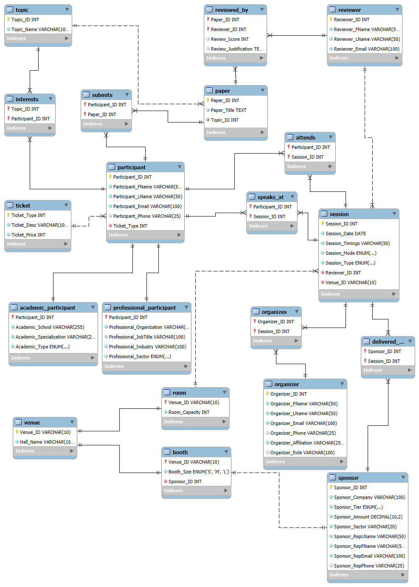
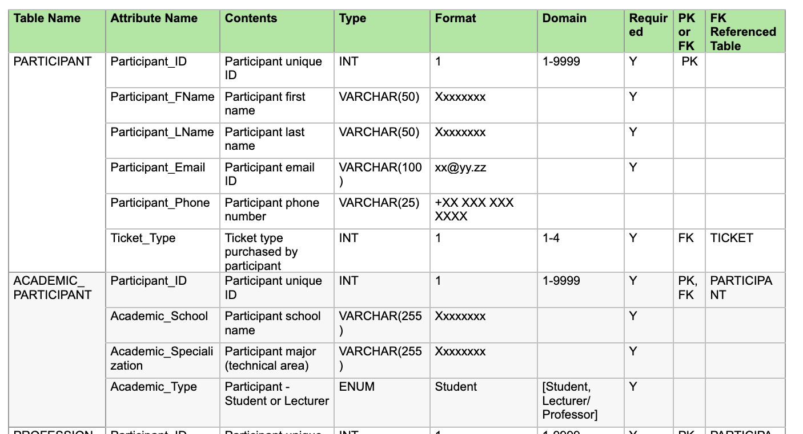

# CyberMACS International Applied Cybersecurity Conference Management System

## About
In the course Data Base, we designed and implemented a relational database SQL for the **CyberMACS International Applied Cybersecurity 
Conference** (IACyC 2025), simulating real-world data management in a large-scale international event. 
We also created several meaningful queries to support data-driven decision-making within the context of conference management.

## Project Objective

* Tracks conference participants, their affiliations, and attendance types (on-site or online).
* Supports paper submissions, co-authoring, and review workflows.
* Manages sessions, speakers, and scheduling conflicts.
* Handles sponsor information, tiers, and financial contributions.
* Generates queries and reports to aid decision-making and event management.
* Enables notifications and traceable communication with participants and stakeholders.

## Key Features

## Key Entities

### Participants 
Receive notifications for:

  * Paper submission deadlines
  * Acceptance or rejection of submitted papers
  * Program schedule including session topics and speaker names

### Organizers
Access to:

  * Ticket sales summary
  * List of submitted papers with status (under review, accepted, rejected)
  * Invitations for participants with accepted papers
  * Count of papers assigned to each reviewer
  * Scheduled sessions with speaker and topic details
  * Sponsor information and contacts
  * Net earnings through ticket sales and sponsorships

### Reviewers
Access to:

  * Assigned papers for review
  * Deadline notifications
  * Session schedule (if acting as chairperson)

### Speakers
Receive notifications for:

  * Session schedule
  * Venue and session assignments

### Sponsors
Access to:

  * Visibility in event materials and session banners
  * Booth assignments
  * Session assignments as speaker (if applicable)

## Conceptual Design: Chen's Notation Entity Relationship Diagram
* Regular entities (blue boxes) and sub-classes (lighter blue boxes)
* Bridge entities (green boxes) have been included to convert M:N relationships between regular entities
* Relationships between entities (yellow diamond boxes)

## Business Rules- Relationship between Entities
### Participant Relationships

* **Participant – Topic (Interest)**

  * A participant is interested in **1 to 3 topics**.
  * A topic can have **one or many participants** interested in it.

* **Participant – Paper (Submission)**

  * A participant submits **one or many papers**.
  * A paper is submitted by **one or many participants**.

* **Participant – Session (Attendance)**

  * A participant attends **one or many sessions**.
  * A session is attended by **one or many participants**.

* **Participant – Session (Speaker)**

  * A participant speaks at **one or many sessions**.
  * A session is delivered by **one or many participants**.

* **Participant – Ticket (Purchasing)**

  * A participant purchases **one ticket**.
  * A ticket is purchased by **one or many participants**.

### Reviewer Relationships

* **Reviewer – Paper (Reviewing)**

  * A reviewer reviews **one or many papers**.
  * A paper is reviewed by **two or more reviewers**.

* **Reviewer – Session (Chairing)**

  * A reviewer chairs **one or many sessions**.
  * A session is chaired by **one reviewer**.

### Paper Relationships

* **Paper – Topic (Classification)**

  * A paper is linked to **only one topic**.
  * A topic is linked to **one or many papers**.

### Sponsor Relationships

* **Sponsor – Booth (Assignment)**

  * A sponsor is assigned **one booth (venue)**.
  * A booth (venue) is assigned to **one sponsor**.

* **Sponsor – Session (Speaker)**

  * A sponsor speaks at **one or many sessions**.
  * A session is delivered by **one or many sponsors**.

### Room Relationships

* **Room – Session (Location)**

  * A room (venue) hosts **one or many sessions**.
  * A session is held at **one room (venue)**.

### Organizer Relationships

* **Organizer – Session (Organizing)**

  * An organizer organizes **one or many sessions**.
  * A session is organized by **one or many organizers**.

## Relational Schema

## Data Dictionary
Refer to data_dictionary

## Queries

* Participant affiliation summary
* Ticket sales report
* Sponsor contribution report
* Accepted papers report
* Reviewer performance summary
* Event schedule with session times and rooms
* Speaker assignment summary

## Technologies Used

* **Database:** MySQL
* **Query Language:** SQL
* **Design Tools: draw.io
* **Sameple Data: Mockaroo and Tonic Fabricate
